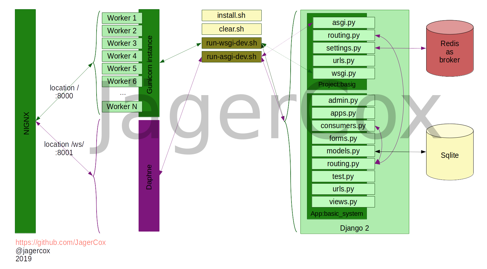

# Django 2, Channels 2, Gunicorn and Daphne

## Example schema



## About

This is a full example about how to integrate Django2 with Channels2 using Gunicorn and Daphne at the same time.
This project was designed as a monolitic application and it was inspired by the official example of [this link](https://channels.readthedocs.io/en/latest/tutorial/index.html).

## Install and run this example

Install dependencies.

```bash
./install.sh
```

Sync DB and fixture.

```
./clean.sh
```


Running instance for WSGI.

```
./run-wsgi-dev.sh
```


Running instance for ASGI

```
./run-asgi-dev.sh
```


## Python3 dependencies

```
daphne<=2.2.5
Django<=2.2
channels<=2.2.5
gunicorn<=19.9.0
channels_redis<=2.3.3
```

## System dependencies

```
python-dev
build-essential tcl
redis-server
```